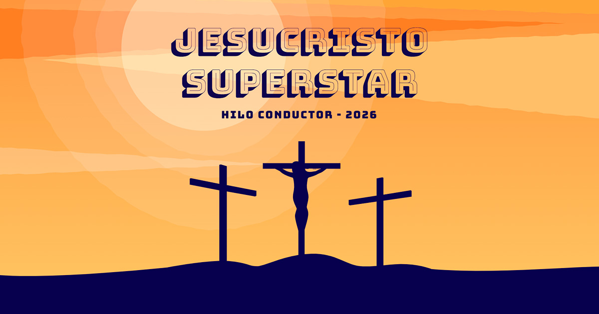

# 🌟 Jesucristo Superstar - Hilo Conductor 2026

 > Aplicación web interactiva diseñada para presentar las escenas, canciones y lecturas bíblicas del "Hilo Conductor" de la campaña 2026 del centro **Juniors M.D. Endavant**.

🌍 **Demo en vivo:** [Añade aquí tu enlace de Vercel/Netlify]

---

## ✨ Características Destacadas

Esta web está diseñada pensando en la inmersión del usuario y en la facilidad de uso en móviles, simulando la experiencia de tener el "libreto" del director en las manos.

* **🎭 Modal "Libreto" Interactivo:** Una ventana inmersiva a pantalla completa que muestra las letras y lecturas. Incluye bloqueo de scroll de fondo y navegación fluida entre escenas (Anterior/Siguiente).
* **📖 Tipografía Inteligente (CSS Columns):** Las letras de las canciones largas se dividen automáticamente en columnas (estilo periódico/biblia) en pantallas grandes, mientras que los textos cortos mantienen un formato de bloque único para facilitar la lectura.
* **🎨 Diseño Temático Retro:** Uso intenso de degradados cálidos (atardecer), fuentes "display" (Bungee) y tipografías manuscritas para darle un toque teatral y musical.
* **⚡ Animaciones Fluidas:** Tarjetas con efectos `hover` (elevación, escalado y sombras dinámicas) e iconos SVG interactivos.
* **📱 100% Responsive:** Diseñado con enfoque *Mobile-First*. Las imágenes SVG del Hero hacen un "zoom" inteligente en móviles para destacar la cruz central.
* **🔍 Optimizado para Compartir (SEO/OG):** Metaetiquetas Open Graph configuradas para que al compartir el enlace por WhatsApp o Redes Sociales aparezca una miniatura y título personalizados.

---

## 🛠️ Tecnologías Utilizadas

* **[React](https://reactjs.org/)**: Librería principal para la interfaz de usuario.
* **[TypeScript](https://www.typescriptlang.org/)**: Tipado estricto para un código más seguro y predecible.
* **[Vite](https://vitejs.dev/)**: Entorno de desarrollo ultrarrápido.
* **[Tailwind CSS v4](https://tailwindcss.com/)**: Framework de utilidades CSS para un diseño ágil y a medida.
* **Iconos SVG**: Personalizados e integrados nativamente para máximo rendimiento.

---

## 📁 Estructura del Proyecto (Clean Code)

El proyecto sigue una arquitectura limpia separando la Vista (Componentes) de los Datos (Información).

```text
src/
├── components/          # Componentes visuales de la interfaz
│   ├── Footer.tsx       # Pie de página y RRSS
│   ├── Hero.tsx         # Sección principal con fondo SVG
│   ├── InfoSection.tsx  # Controlador del Grid y del Modal
│   ├── SceneCard.tsx    # Tarjeta individual de cada escena
│   └── SceneDetailModal.tsx # Ventana emergente con el libreto
│
├── data/                
│   └── escenasData.ts   # 🗄️ TODA LA INFORMACIÓN (Letras, sinopsis, etc.)
│
├── index.css            # Estilos globales y ocultación de scrollbar
└── main.tsx             # Punto de entrada de la aplicación
